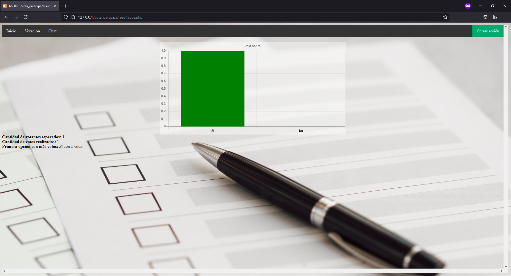
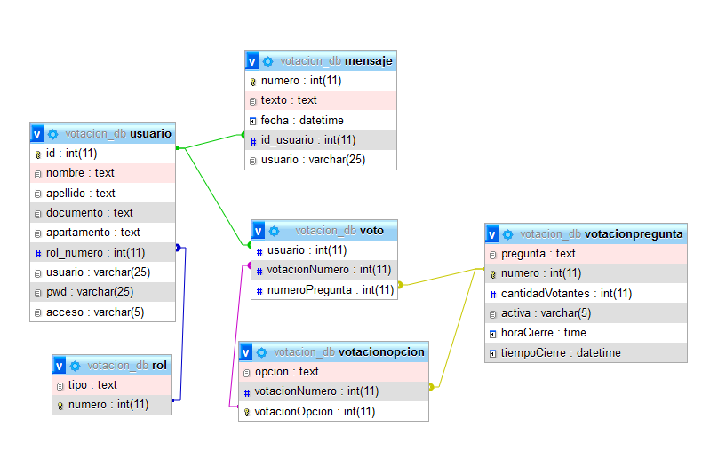

# Vota y Participa
Ejemplo básico de votación e implementación de un chat para votación en apartamentos.
## Idea general
El propósito de los códigos acá publicados es implementar un sistema de votación simple enfocado en propietarios de apartamentos. De igual forma se realiza un chat con el cual los votantes pueden comunicarse. A continuación algunas imágenes.

## Base de datos
La base de datos diseñada es relacional. A continuación el gráfico relacional.

Para más información de la base de datos ver el documento *votacion_db.pdf* ubicado en la carpeta *db*.
## Recomendaciones de implementación
Para poder poner en funcionamiento el sitio web es necesario tener instalado xampp (o un servidor y una base de datos), hecho esto, copiar la carpeta *vota_participa* en *htdocs* que está ubicado en la carpeta en la cual fue instalado xampp. De igual forma, la base de datos *votacion_db.sql* ubicada en la carpeta *db* debe ser cargada en MariaDB (en xampp). Para ingresar se utiliza la dirección del dispositivo, por ejemplo 127.0.0.1/vota_participa.  
Es importante, para el correcto funcionamiento de los programadores en la base de datos que se ingrese el siguiente comando en la base de datos:  
*SET GLOBAL event_scheduler = ON;* o *SET GLOBAL event_scheduler = "ON";*  
## Recursos utilizados
* xampp: Versión 3.3.0 (De allí se hace uso del servidor Apache y la base de datos mysql)
* jquery: Versión 3.6.0
* Chart.js: Versión 2.9.3 
No incluido como un recurso, pero si como referencia constante a dudas y modos de implementación, se utilizó en general los tutoriales y comentarios publicados en [w3schools](https://www.w3schools.com/) y en [stackoverflow](https://es.stackoverflow.com/).